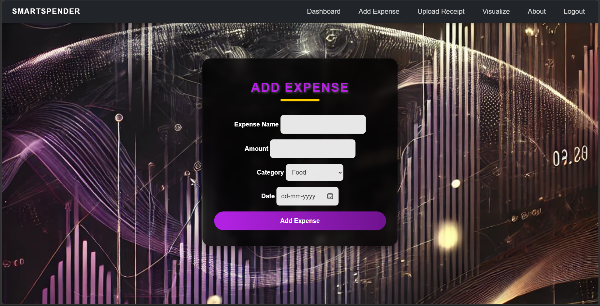
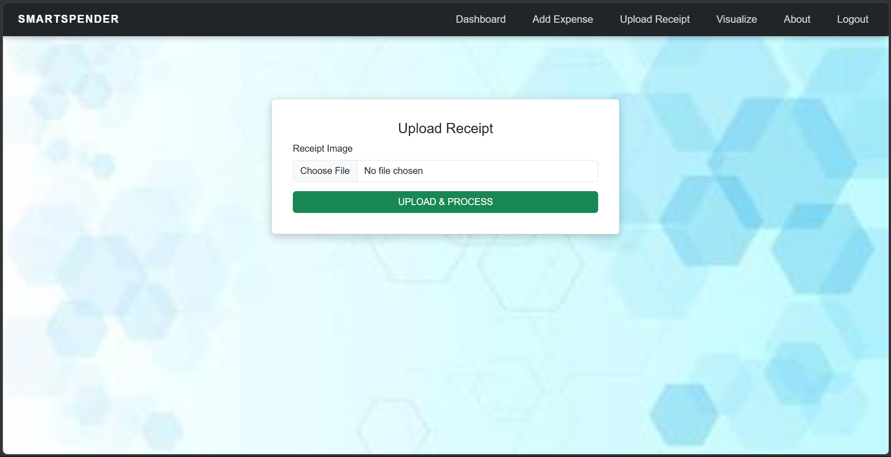

# SmartSpender 💰

SmartSpender is a personal expense management web application built with Python and Flask. It helps users record, manage, and analyze their daily expenses through an easy-to-use web interface.

The application also provides receipt upload and OCR processing, voice-based expense entry, expense visualization, and PDF report generation.

## ✨ Features

- 🔐 User registration and login
- 💸 Add, edit, and manage expenses
- 🧾 Upload and process receipts
- 🔎 OCR-based receipt text extraction
- 🎙️ Voice-based expense entry
- 📊 Expense visualization and analysis
- 📅 Date-based expense management
- 📄 PDF report generation
- 🗄️ Database management using SQLAlchemy
- 🔄 Database migrations using Flask-Migrate

## 🛠️ Technologies Used

- Python
- Flask
- Flask-SQLAlchemy
- SQLite
- Flask-Login
- Flask-WTF
- Flask-Migrate
- Flask-Session
- OpenCV
- Tesseract OCR
- PyTesseract
- SciPy
- ReportLab
- HTML5
- CSS3
- JavaScript

## 📂 Project Structure

```text
SmartSpender/
│
├── app/
│   ├── static/
│   │   ├── css/
│   │   ├── images/
│   │   ├── js/
│   │   └── videos/
│   │
│   ├── templates/
│   ├── utils/
│   ├── __init__.py
│   ├── forms.py
│   ├── models.py
│   └── routes.py
│
├── migrations/
├── config.py
├── date.py
├── requirements.txt
├── run.py
├── test.py
├── test_dateparser.py
├── test_voice_command.py
├── .gitignore
└── README.md
```

## ⚙️ Installation and Setup

### 1. Clone the repository

```bash
git clone https://github.com/sanjay-techbuilds/smartspender.git
cd smartspender
```

### 2. Create a virtual environment

```bash
python -m venv venv
```

### 3. Activate the virtual environment

**Windows:**

```bash
venv\Scripts\activate
```

### 4. Install the required dependencies

```bash
pip install -r requirements.txt
```

### 5. Configure environment variables

Create a `.env` file in the project root and add the required secret keys and API configuration.

**Do not upload the `.env` file to GitHub.**

### 6. Initialize the database

Run the existing database migrations:

```bash
python -m flask --app run.py db upgrade
```

### 7. Run the application

```bash
python run.py
```

Open the application in your browser:

```text
http://127.0.0.1:5000
```

## 🧪 Testing

The project includes test files for different application components.

```bash
python test.py
python test_dateparser.py
python test_voice_command.py
```

## 📸 Application Screenshots

### 🔐 Login


### 📊 Dashboard


### 💸 Add Expense



### 🧾 Receipt Upload & OCR



### 📈 Expense Visualization


### ℹ️ About SmartSpender


## 🎯 Project Objective

The objective of SmartSpender is to simplify personal expense management by combining traditional expense tracking with automated receipt processing, OCR, voice-based input, and visual expense analysis.

## 🚀 Future Enhancements

- AI-powered spending insights
- Advanced budgeting recommendations
- Improved receipt recognition
- Monthly and yearly financial reports
- Mobile application
- Cloud database integration
- Personalized spending recommendations

## 🔐 Security

Sensitive information such as API keys, passwords, environment variables, local databases, virtual environments, and user-uploaded receipt images are excluded from Git using `.gitignore`.

## 👨‍💻 Author

**Sanjay S**

GitHub: https://github.com/sanjay-techbuilds

---

⭐ If you find this project useful, consider giving it a star!